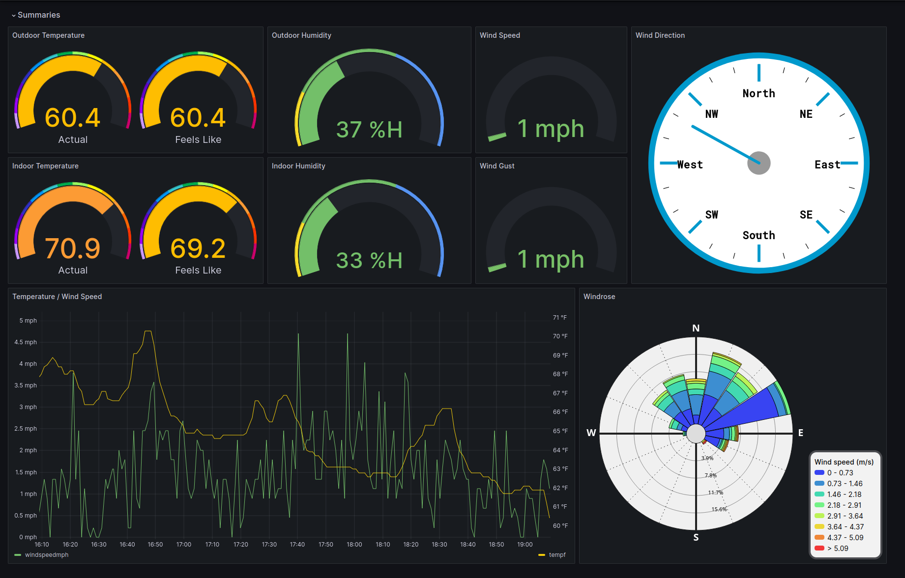

	 
	

		
	

	 

# AmbientWeather.net Collector

I got my dad a weather station for his birthday. It connects to our internet and sends data to https://ambientweather.net (AW).

As it just so happens, AW [runs a websocket](https://ambientweather.docs.apiary.io/#reference/ambient-realtime-api) that will relay the data sent from the station to subscribed clients.

This service subscribes to the websocket and inserts the data into [Timescale](https://timescale.com/) so it can be displayed in [Grafana](https://grafana.com/).

# Usage

Soon:tm:
